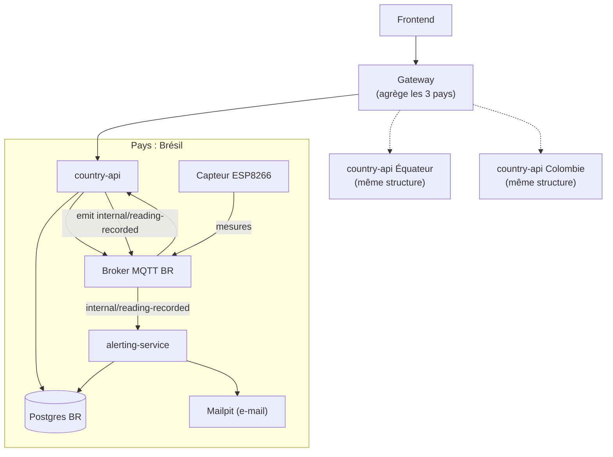

# FutureKawa

Suivi multi-pays des stocks de café vert (Brésil, Équateur, Colombie) : traçabilité des lots, surveillance IoT (température/humidité) via MQTT, et alerting automatique par e-mail. Projet réalisé dans le cadre de la MSPR TPRE814.

## Architecture

Un backend conteneurisé par pays (BDD + broker MQTT + API REST + alerting), et un backend central qui agrège les 3 pays pour le frontend. Détaillé ici pour le Brésil ; l'Équateur et la Colombie suivent exactement la même structure, en parallèle et isolés les uns des autres.



Chaque pays a : sa propre base de données, son propre broker MQTT, son `country-api` (lots, entrepôts, ingestion des mesures) et son `alerting-service` (seuils température/humidité, cron des lots périmés, envoi d'e-mail). Un processus séparé mais qui reste dans le périmètre local du pays. Aucune donnée n'est partagée entre pays au niveau du stockage. Le `gateway` est le seul composant qui connaît les 3 pays.

`country-api` et `alerting-service` communiquent via le broker MQTT du pays : après avoir enregistré une mesure, `country-api` publie un événement interne (`internal/reading-recorded`) que `alerting-service` écoute pour déclencher ses vérifications de seuil.

## Stack

- **Backend** : NestJS (TypeScript), Prisma 7 (PostgreSQL), MQTT (Eclipse Mosquitto)
- **Frontend** : Next.js
- **IoT** : ESP8266/ESP32 + capteur DHT11, PlatformIO
- **Monorepo** : Nx
- **Infra** : Docker Compose

## Démarrage rapide

Prérequis : Docker.

```sh
git clone https://github.com/itsarnaud/FutureKawa && cd FutureKawa
npm start
```

Ce script (`scripts/start.sh`) fait tout en une commande : crée `.env` depuis `.env.exemple` si besoin, build et démarre toute la stack (3 `country-api` + 3 `alerting-service`, une par pays, chacune avec sa base et son broker MQTT, le `gateway`, et Mailpit), attend que les 3 bases soient prêtes, pousse le schéma Prisma et injecte les données de démo pour chaque pays, puis affiche les URLs de tous les services.

Pour tout arrêter :

```sh
docker compose down
```

Pour repartir d'une base propre (pousser le schéma / re-seed manuellement sur un pays donné) :

```sh
DATABASE_URL="postgresql://postgres:<password>@localhost:5433/mydb?schema=public" npx prisma db push
DATABASE_URL="postgresql://postgres:<password>@localhost:5433/mydb?schema=public" SEED_COUNTRY=BR npx prisma db seed
# répéter avec le port 5434/SEED_COUNTRY=EC et 5435/SEED_COUNTRY=CO
```

| Service | URL |
|---|---|
| Gateway (API centrale) | http://localhost:3010/api |
| country-api Brésil | http://localhost:3000/api |
| country-api Équateur | http://localhost:3002/api |
| country-api Colombie | http://localhost:3003/api |
| Mailpit (e-mails d'alerte) | http://localhost:8025 |

## Structure du dépôt

```
apps/
  country-api/     # API REST par pays : lots, entrepôts, ingestion des mesures IoT (MQTT)
  alerting-service/ # Microservice par pays : seuils température/humidité, lots périmés, e-mail
  gateway/         # API centrale : agrège les 3 country-api pour le frontend
  fe/              # Frontend Next.js
libs/
  db/              # PrismaService/PrismaModule partagés
prisma/
  schema.prisma    # Modèle de données (Lot, Warehouse, Exploitation, IotDevice, Alert...)
  seed.ts          # Données de démo (SEED_COUNTRY=BR|EC|CO pour cibler un seul pays)
IOT/
  futurekawa-iot-esp32/  # Firmware capteur (PlatformIO)
  broker/          # Config Mosquitto
docker-compose.yml # Orchestration complète (BDD, brokers, APIs, gateway, mailpit)
scripts/
  start.sh         # Démarrage one-command (build, migrations, seed, récap des URLs)
```

## Commandes utiles

```sh
npx nx serve country-api      # lancer country-api en local (hors Docker)
npx nx serve gateway           # lancer gateway en local (hors Docker)
npx nx test <projet>           # tests unitaires d'un projet
npx nx lint <projet>           # lint
```

## Convention MQTT

Chaque capteur publie sur `{pays}/{entrepot}/mesures` (ex. `bresil/entrepot1/mesures`) au format :

```json
{ "temperature": 29.4, "humidite": 56.1, "timestamp": "2026-07-03T10:00:00Z" }
```

En interne, après avoir persisté une mesure, `country-api` publie sur `internal/reading-recorded` (même broker) pour déclencher la vérification de seuil côté `alerting-service`.
