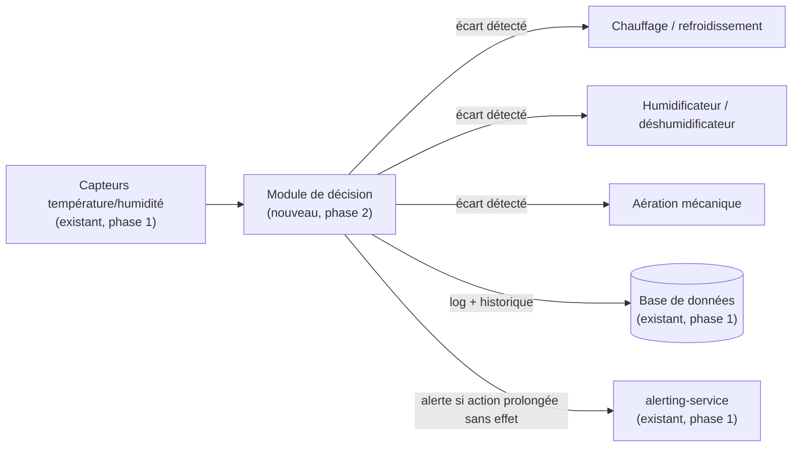

# FutureKawa — Schéma de principe : automatisation des entrepôts (phase 2)

> Document de conception, hors périmètre de développement de la phase 1. Il décrit comment la
> solution IoT existante (mesure seule) évoluerait vers un pilotage automatisé des équipements
> d'entrepôt (chauffage, humidification, aération), conformément au cahier des charges §10.3.

## 1. Périmètre et hypothèses

La phase 1 se limite à la **remontée de mesures** (température/humidité) et à l'**alerte** en cas de
dépassement de seuil : aucune action correctrice n'est déclenchée automatiquement sur l'entrepôt.

La phase 2 introduirait des **actionneurs** capables d'agir sur les conditions de stockage :

- un système de **chauffage/refroidissement** (selon le pays, la cible est parfois d'abaisser la
  température — Colombie 26 °C — parfois de la maintenir plus haute — Équateur 31 °C) ;
- un **humidificateur/déshumidificateur** ;
- une **aération mécanique** (extracteur, brasseur d'air) pour homogénéiser l'entrepôt et limiter les
  points chauds/humides locaux.

Hypothèse documentée (aucun contact client réel, cf. §12 du cahier des charges) : chaque entrepôt
serait équipé d'un jeu d'actionneurs indépendant, piloté localement, et non d'une centrale de
traitement d'air mutualisée entre entrepôts.

## 2. Logique capteurs → décision → actionneurs

Le module de décision est un **nouveau composant**, positionné entre l'ingestion des mesures (déjà en
place via `country-api`/MQTT) et les actionneurs physiques. Il réutilise le référentiel de seuils déjà
défini en base (`Country.tempIdeal`, `tempTolerance`, `humidityIdeal`, `humidityTolerance`) pour éviter
toute duplication de configuration entre alerting et pilotage automatique.

### Boucle de contrôle (par entrepôt)

1. Lecture de la dernière mesure (température, humidité).
2. Comparaison à la plage cible du pays (± tolérance).
3. Si hors plage : activation de l'actionneur pertinent (ex. température trop basse → chauffage ON),
   avec une **temporisation** avant réévaluation (éviter les cycles marche/arrêt trop rapprochés,
   phénomène de « pompage »).
4. Si retour dans la plage : arrêt de l'actionneur.
5. Si l'écart persiste au-delà d'une durée seuil malgré l'action corrective (ex. 30 min) : déclenchement
   d'une alerte dédiée (« correction automatique inefficace ») à destination du responsable
   d'exploitation — l'automatisation ne doit jamais masquer un problème matériel plus grave (panne de
   chauffage, porte d'entrepôt restée ouverte, etc.).

## 3. Cas nominal

- Les mesures restent dans la plage cible : aucun actionneur n'est sollicité, seule la supervision
  (déjà existante) continue de tourner.
- Un écart ponctuel est détecté : l'actionneur adéquat est activé automatiquement, l'écart se résorbe
  dans le délai attendu, l'actionneur s'arrête. L'épisode est journalisé (nouvelle entité, ex.
  `ActionneurEvent`) pour traçabilité, au même titre que les mesures IoT actuelles.

## 4. Cas dégradé

Plusieurs situations dégradées doivent être anticipées :

| Situation | Comportement attendu |
|---|---|
| Perte de communication avec un actionneur | Alerte immédiate « actionneur injoignable » ; aucun blocage du reste du système (le module de décision continue de superviser les autres actionneurs/entrepôts). |
| Correction automatique sans effet après délai seuil | Alerte « correction automatique inefficace » + passage en mode manuel pour cet entrepôt (l'automatisation cesse d'agir tant qu'un humain n'a pas acquitté l'incident, pour éviter de solliciter un équipement en panne en boucle). |
| Coupure réseau/MQTT (même panne que pour les capteurs, cf. dossier technique §4.2) | Le module de décision applique la dernière consigne connue pendant une durée limite, puis bascule en mode sans risque (voir sécurités ci-dessous) si aucune mesure fraîche n'est reçue. |
| Valeurs de capteurs aberrantes (ex. capteur défectueux) | Rejet de la mesure (déjà couvert par la validation du DTO en phase 1) ; si la situation persiste, alerte dédiée plutôt que pilotage sur une donnée non fiable. |

## 5. Sécurités

- **Seuils de sécurité distincts des seuils qualité** : une plage de sécurité plus large que la plage
  qualité (ex. ±3 °C pour l'alerte qualité, mais arrêt d'urgence si l'écart dépasse ±10 °C), pour ne
  déclencher l'arrêt d'urgence que dans les cas réellement critiques.
- **Arrêt d'urgence logique** : le module de décision peut couper tous les actionneurs d'un entrepôt à
  distance (bouton dans l'interface web, réservé aux rôles habilités) en cas de doute sur leur bon
  fonctionnement.
- **Arrêt d'urgence manuel** : chaque actionneur physique conserve un interrupteur/coupe-circuit local,
  indépendant du système logiciel — l'automatisation ne doit jamais être le seul moyen d'arrêter un
  équipement.
- **Mode manuel de repli** : à tout moment, un opérateur terrain peut désactiver le pilotage automatique
  d'un entrepôt et reprendre la main manuellement, sans redémarrage du système.
- **Non-régression sur l'alerting existant** : les règles d'alerte de la phase 1 (hors plage, lot
  périmé) continuent de s'appliquer indépendamment de l'automatisation — l'automatisation est un
  mécanisme correctif, pas un remplacement de la supervision humaine.

## 6. Point d'intégration avec la solution IoT existante

- Le module de décision se branche en aval de `country-api` (source des mesures) et ne modifie pas le
  pipeline d'ingestion actuel (MQTT → `MeasuresService` → base de données).
- Il consommerait les mesures de la même façon que `alerting-service` aujourd'hui (écoute de
  l'évènement interne `internal/reading-recorded`), ce qui permet de l'ajouter comme un service
  supplémentaire dans le même pays, sans toucher à `country-api`.
- Les actionneurs physiques publieraient leur propre état sur MQTT (topic dédié, ex.
  `{pays}/{entrepot}/actionneurs/etat`), suivant la même convention de nommage que les topics de mesure
  actuels (cf. dossier technique §4.2), afin de rester cohérent avec l'existant.
- Aucune modification du firmware capteur (ESP8266/DHT11) n'est nécessaire : la phase 2 ajoute des
  équipements et un service de décision, elle ne change pas la chaîne de mesure.
