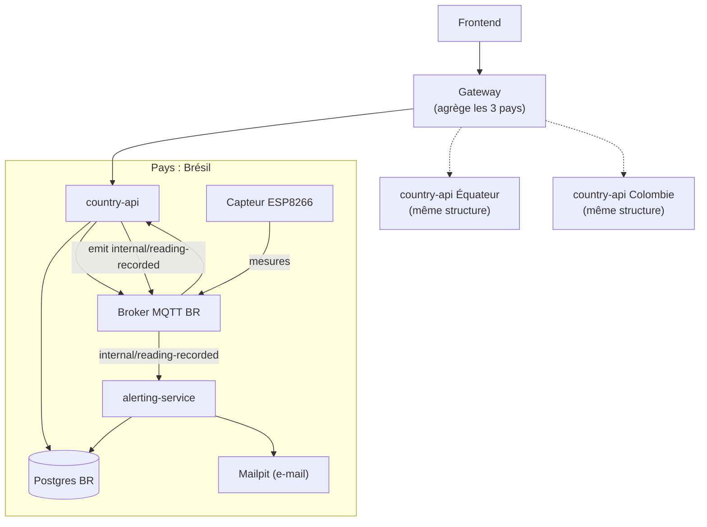
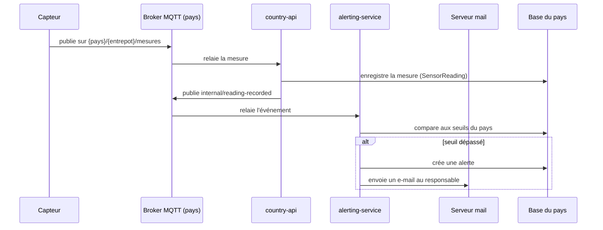

# FutureKawa : dossier technique

## 4.1 Architecture globale

### Découpage

Le système repose sur un découpage entre un backend local par pays et un backend central côté siège, conformément au sujet.

**Niveau local (par pays : Brésil, Équateur, Colombie)**

Chaque pays dispose d'une infrastructure identique et isolée des deux autres :

- une base PostgreSQL dédiée ;
- un broker MQTT dédié (Eclipse Mosquitto) ;
- `country-api` : API REST pour la gestion des lots et des entrepôts, ainsi que l'ingestion des mesures IoT via MQTT ;
- `alerting-service` : service applicatif dédié qui applique les règles de seuil (température, humidité), contrôle l'ancienneté des lots (péremption au-delà de 365 jours) et envoie les e-mails d'alerte.

**Niveau central (siège)**

Le `gateway` interroge les trois `country-api`, en parallèle et de façon tolérante aux pannes, pour consolider trois types de données à destination du frontend : l'état des stocks (`/lots`), les mesures historiques (`/warehouses/:id/readings`) et les alertes (`/alerts`).

Le schéma ci-dessous détaille l'architecture pour le Brésil ; l'Équateur et la Colombie suivent exactement la même structure, en parallèle et isolés les uns des autres.



Chaque pays dispose de sa propre base de données, de son propre broker MQTT, de son `country-api` et de son `alerting-service`, sans partage de données entre pays au niveau du stockage. Le `gateway` est le seul composant qui connaît les 3 pays.

### Flux principal : d'une mesure IoT à une alerte



Le frontend, de son côté, interroge exclusivement le `gateway`, qui route la requête vers un seul pays si un filtre est précisé, ou vers les trois en parallèle sinon.

### Architecture frontend

Next.js (App Router), organisé par domaine sous `apps/fe/src` :

- `types/domain.ts` : types miroirs des réponses du gateway (`Country`, `Warehouse`, `Lot`, `SensorReading`, `Alert`).
- `lib/gateway.ts` : client typé au-dessus d'un wrapper `fetch` (`lib/api.ts`) — un point d'entrée par ressource (`getLots`, `getWarehouses`, `getWarehouse`, `getWarehouseReadings`, `getAlerts`).
- `hooks/use-*.ts` : un hook par ressource (`useLots`, `useWarehouses`, `useWarehouse`, `useWarehouseReadings`, `useAlerts`), tous bâtis sur un helper interne partagé (`hooks/internal/use-async-resource.ts`) qui gère chargement/erreur/polling. Pas de librairie de fetching (react-query, swr) : le monorepo n'en a pas, ce pattern reste volontairement simple.
- `components/dashboard/` : composants de présentation purs (`LotsTable`, `AlertPanel`, `IoTCharts`) qui ne font aucun appel réseau — ils reçoivent leurs données en props depuis les pages.

**Sélection d'un pays.** Chaque page (`/dashboard`, `/dashboard/lots`, `/dashboard/entrepots`, `/dashboard/alertes`) expose un sélecteur "Tous pays / BR / EC / CO". Sans pays sélectionné, le gateway est appelé sans `?country`, ce qui déclenche son agrégation des 3 `country-api` ; avec un pays précis, le paramètre est transmis tel quel. Les endpoints `/warehouses/:id` et `/warehouses/:id/readings` exigent un pays (contrainte du gateway) : en mode "Tous pays", les courbes IoT et les KPI température/humidité affichent un état vide explicite plutôt que d'agréger des seuils incompatibles entre pays.

**Lots triés (FIFO).** `country-api` renvoie déjà les lots triés par `storedAt` croissant ; `LotsTable` reprend ce tri par défaut côté client (avec bascule asc/desc) et un indicateur visuel rappelant la règle FIFO.

**Détail d'un entrepôt.** `/dashboard/entrepots/[id]` combine `useWarehouse` (métadonnées + seuils du pays), `useWarehouseReadings` (courbes température/humidité via `IoTCharts`) et `useLots({ warehouseId })` (`LotsTable` filtrée à cet entrepôt).

**Alertes.** `/dashboard/alertes` filtre par pays et par statut d'envoi (`sent`), et réutilise `AlertPanel` (utilisé aussi dans le tableau de bord principal) pour l'affichage.

**Déploiement.** Voir la section [Frontend](../README.md#frontend) du README pour la variable d'environnement `NEXT_PUBLIC_API_URL` et le Dockerfile.

### Justification des choix technologiques

- **NestJS** structure les trois applications backend selon le même modèle (modules, contrôleurs, services) et fournit un support natif des microservices MQTT, sans dépendance additionnelle.
- **Prisma** génère un typage à partir d'un schéma unique, partagé par les trois bases identiques (un schéma, une base par pays).
- **MQTT et Mosquitto** sont imposés par le sujet pour la remontée des mesures IoT ; le même broker sert aussi de bus de communication interne entre `country-api` et `alerting-service`, évitant d'introduire un second mécanisme de messagerie.
- **Docker Compose** permet de démarrer l'ensemble du backend (trois pays et siège) en une seule commande, conformément à l'attendu du livrable 1.

### Éléments de robustesse

| Aspect | Mise en œuvre |
|---|---|
| Tolérance aux pannes partielles | Le gateway interroge les trois pays via `Promise.allSettled` : si un `country-api` est indisponible, les résultats des deux autres pays sont tout de même retournés, sans erreur globale. |
| Isolation par pays | Base de données et broker MQTT dédiés par pays. Une panne sur un pays n'affecte jamais les deux autres. |
| Reprise automatique | Tous les services Docker sont configurés en `restart: unless-stopped` : un arrêt inattendu entraîne un redémarrage automatique du conteneur. |
| Journalisation | Chaque service utilise le logger structuré de NestJS, avec des messages contextualisés (pays, opération, erreur), collectés par Docker. |
| Supervision | Limitée aux logs Docker et aux vérifications manuelles décrites en 4.3. Aucun outil de supervision centralisée (type Prometheus/Grafana) n'est en place à ce stade, ce qui correspond au périmètre d'un prototype de démonstration. |

## 4.2 Conception du module IoT

### Architecture MQTT

Un broker Mosquitto est déployé par pays (Brésil, Équateur, Colombie) plutôt qu'un broker unique partagé. Ce choix apporte une résilience directement liée à l'architecture distribuée pays/siège du projet : la panne d'un broker n'affecte que le pays concerné, les deux autres continuent de fonctionner normalement. La configuration Docker Compose des trois brokers repose sur un template YAML commun (`x-mosquitto-template`), afin d'éviter la duplication de configuration.

### Structure des topics

Chaque entrepôt publie sur un topic dédié :

```
{pays}/{entrepot}/mesures
```

Exemple : `bresil/entrepot1/mesures`.

Le capteur DHT11 mesurant température et humidité simultanément, un seul topic par entrepôt est utilisé plutôt que deux topics séparés, ce qui évite de dupliquer inutilement les messages.

### Format du payload

```json
{
  "temperature": 29.5,
  "humidite": 56.2,
  "timestamp": "2026-04-17T15:30:45Z"
}
```

Le pays et l'entrepôt sont volontairement absents du payload puisqu'ils sont déjà portés par le topic. L'horodatage est au format ISO 8601, obtenu par synchronisation NTP sur l'ESP8266.

### Qualité de service (QoS)

Le QoS 1 a été retenu comme compromis entre fiabilité et consommation. Il garantit la livraison du message (au moins une fois) sans le coût du QoS 2, qui impose quatre échanges réseau contre deux. Les doublons occasionnels que peut produire le QoS 1 ne posent pas de difficulté pour ce cas d'usage, les mesures étant redondantes toutes les cinq minutes ; de la même façon, la perte d'un message reste sans conséquence puisque la mesure suivante arrive rapidement.

### Fréquence de mesure

Une mesure est publiée toutes les cinq minutes. Les conditions de stockage évoluant lentement, sans variation brutale, cette fréquence offre un bon compromis entre réactivité de détection des dérives et volume de données généré (environ 105 000 mesures par an et par entrepôt, un volume aisément gérable en base).

### Matériel et câblage

- Microcontrôleur : ESP8266 (fourni par l'organisme de formation)
- Capteur : DHT11, température et humidité

Le DHT11 est un capteur d'entrée de gamme, peu coûteux, adapté à un contexte de preuve de concept. Il permet de valider l'architecture de bout en bout (capteur, MQTT, broker, backend) sans complexité matérielle superflue.

| Broche DHT11 | Câble | Broche ESP8266 | Fonction |
|---|---|---|---|
| + (VCC) | Vert | 3V | Alimentation 3,3 V |
| - (GND) | Noir | G | Masse |
| S (Signal) | Jaune | D4 (GPIO2) | Transmission des données |

```
      DHT11
    ┌───────┐
    │   +   │────── Vert ────→ 3V   (ESP8266)
    │   -   │────── Noir ────→ G    (ESP8266)
    │   S   │────── Jaune ───→ D4   (ESP8266)
    └───────┘
```

### Stratégie de prototypage

Un seul ESP8266 physique est connecté en conditions réelles, simulant l'entrepôt `bresil/entrepot1`. Les autres entrepôts et pays sont simulés par scripts, ce qui permet au reste de l'équipe de développer sans dépendre du matériel physique.

### Limites et risques identifiés

**Sensibilité du câblage.** Une inversion des broches VCC et GND provoque un court-circuit et une surchauffe immédiate du microcontrôleur, pouvant l'endommager de façon irréversible. Ce risque a été rencontré en conditions réelles lors du prototypage, d'où l'importance de vérifier systématiquement le câblage avant toute mise sous tension et de documenter précisément le schéma de câblage. En production, l'usage de connecteurs polarisés ou de modules pré-câblés réduirait ce risque.

**Fréquence de lecture limitée.** Le DHT11 impose une fréquence de lecture minimale, de l'ordre d'une mesure par seconde au maximum, une lecture plus espacée étant recommandée pour la fiabilité. La fréquence retenue pour le projet, une mesure toutes les cinq minutes, reste très largement compatible avec cette contrainte. Cette limite deviendrait bloquante si le besoin métier évoluait vers une surveillance à plus haute fréquence, ce qui nécessiterait un capteur plus réactif.

**Précision du capteur.** Le DHT11 offre une précision limitée, de l'ordre de ± 2 °C et ± 5 % d'humidité selon les caractéristiques constructeur. Cette précision reste acceptable au regard des tolérances définies dans le cahier des charges (± 3 °C et ± 2 % d'humidité), mais elle est à la limite basse sur l'humidité. Pour un déploiement en production, un capteur de gamme supérieure (DHT22 ou capteur industriel) serait recommandé.

### Stratégie de reconnexion et gestion des erreurs

Le contexte terrain, des entrepôts avec un réseau parfois instable, impose une gestion robuste des coupures de connexion. Deux niveaux sont surveillés indépendamment dans le firmware : le WiFi et le broker MQTT.

**Coupure WiFi.** À chaque itération de la boucle principale, l'état de la connexion est vérifié. En cas de déconnexion, une reconnexion est immédiatement engagée avant toute autre opération :

```cpp
if (WiFi.status() != WL_CONNECTED) {
  Serial.println("WiFi déconnecté, tentative de reconnexion...");
  setup_wifi();
}
```

Cette reconnexion est bloquante : le programme attend le rétablissement du WiFi avant de continuer. Ce choix est assumé, car sans WiFi aucune donnée ne peut de toute façon être transmise au broker.

**Déconnexion du broker MQTT.** Indépendamment du WiFi, la connexion au broker est vérifiée à chaque itération. En cas de déconnexion, une boucle de reconnexion retente la connexion toutes les cinq secondes jusqu'à succès, sans bloquer le WiFi qui reste actif entre-temps :

```cpp
void reconnect() {
  while (!client.connected()) {
    if (client.connect("ESP8266-Bresil-Entrepot1")) {
      Serial.println("connecté");
    } else {
      Serial.print("échec, rc=");
      Serial.println(client.state());
      delay(5000);
    }
  }
}
```

La vérification WiFi précède systématiquement la vérification MQTT, la connexion MQTT dépendant entièrement de la disponibilité du réseau.

**Erreur de lecture capteur.** Les valeurs lues sont vérifiées avant publication pour détecter une éventuelle erreur de lecture et éviter d'envoyer une donnée invalide :

```cpp
if (isnan(temp) || isnan(hum)) {
  Serial.println("Erreur de lecture du capteur DHT!");
  return;
}
```

**Absence de tampon de données.** En l'état, aucune donnée n'est mise en mémoire tampon pendant une coupure : les mesures qui auraient dû être envoyées sont simplement perdues, la suivante étant envoyée normalement au retour de connexion. Ce comportement est cohérent avec le choix de QoS 1 et la fréquence de mesure de cinq minutes.

Trois options de stockage tampon ont été envisagées. Un stockage déporté sur un poste tiers a été écarté car il repose lui-même sur le réseau WiFi, dont la coupure est précisément le problème à tolérer. La mémoire flash interne de l'ESP8266 (SPIFFS ou LittleFS) est techniquement possible sans matériel additionnel, mais sa capacité limitée à quelques centaines de kilo-octets ne permettrait de tamponner qu'un nombre restreint de mesures. Un support de stockage externe, de type carte SD, serait la solution la plus robuste pour un déploiement en production, mais nécessite un module matériel non inclus dans le kit de prototypage actuel.

L'absence de tampon est donc un choix assumé pour ce prototype, cohérent avec le contexte de preuve de concept et les contraintes matérielles disponibles.

### Infrastructure Docker

Les trois brokers Mosquitto sont conteneurisés avec persistance des données, et intégrés au `docker-compose.yml` global du projet aux côtés des bases PostgreSQL et de Redis, l'ensemble des services partageant le réseau `futurekawa-network`.

### Persistance et traçabilité

Chaque capteur est enregistré en base et rattaché à un entrepôt. Chaque mesure reçue crée un enregistrement conservé indéfiniment pour l'historique, indexé par capteur et par date afin de permettre une consultation efficace.

### Préparation à l'automatisation

Le système est aujourd'hui limité à la remontée de mesures, sans pilotage d'actionneurs. Le schéma de principe pour une évolution future (chauffage, humidificateur, aérateur) fait l'objet d'un document dédié, couvrant le fonctionnement nominal, le fonctionnement dégradé et les sécurités associées.

## 4.3 Plans de tests détaillés

### Stratégie et typologie

| Niveau | Outil | Approche |
|---|---|---|
| Unitaire | Jest | Services et contrôleurs de `country-api`, `alerting-service` et `gateway`. La logique métier (calcul de seuils, agrégation multi-pays, gestion des lots) est testée avec Prisma et MQTT simulés. |
| Intégration | Jest et Docker | Vérification que chaque module fonctionne correctement avec Prisma et MQTT réels, via les conteneurs. |
| API | curl | Vérification systématique du comportement HTTP réel à chaque évolution de l'architecture. |
| End-to-end | Simulation MQTT | La chaîne complète, du capteur à l'e-mail d'alerte, est vérifiée en simulant un message MQTT identique à celui du firmware, sans dépendre du matériel physique. |
| UI | À compléter | Stratégie de tests frontend à documenter par le développeur concerné (voir section dédiée ci-dessous). |

La priorité a été donnée aux tests unitaires, exécutés à chaque changement via une commande unique, et à une vérification API et end-to-end ciblée sur les points sensibles de l'architecture : le cloisonnement des données par pays et la chaîne complète depuis la mesure IoT jusqu'à l'alerte.

```sh
npm test
```

Cette commande exécute l'ensemble des tests unitaires backend (`country-api`, `alerting-service`, `gateway`).

### Cas de test

| # | Cas de test | Données | Commande | Critère de réussite |
|---|---|---|---|---|
| 1 | Cloisonnement des données par pays | Trois bases initialisées avec les données de démonstration de leur pays respectif | `curl http://localhost:3000/api/lots` (instance Brésil) | La réponse ne contient que des lots brésiliens |
| 2 | Agrégation multi-pays côté gateway | Trois bases initialisées | `curl http://localhost:3010/api/lots` | La réponse contient les lots des trois pays |
| 3 | Filtrage par pays valide | Trois bases initialisées | `curl http://localhost:3010/api/lots?country=BR` | La réponse ne contient que des lots brésiliens |
| 4 | Rejet d'un code pays invalide | Aucune | `curl http://localhost:3010/api/lots?country=XX` | Réponse HTTP 400 avec message d'erreur explicite |
| 5 | Ingestion d'une mesure IoT | Message JSON publié sur le topic de mesure d'un entrepôt | Publication MQTT sur `bresil/entrepot1/mesures` | La mesure est enregistrée et consultable via l'API des mesures historiques |
| 6 | Déclenchement d'une alerte | Mesure hors des seuils de tolérance du pays | Idem cas 5, puis consultation des alertes | Une alerte est créée et un e-mail est envoyé |
| 7 | Absence d'alerte dans les seuils | Mesure conforme aux seuils du pays | Idem cas 5 | Aucune alerte n'est créée, aucun e-mail n'est envoyé |
| 8 | Tolérance à une panne partielle | Un `country-api` arrêté volontairement | `curl http://localhost:3010/api/lots` | Réponse HTTP 200 contenant les données des pays disponibles |

Ces huit cas de test ont été exécutés et validés sur l'environnement de démonstration.

### Gestion des anomalies

Le traitement d'une anomalie suit systématiquement trois étapes :

1. **Constat.** Reproduction du problème à l'aide des commandes de test ci-dessus, ou analyse des journaux du service concerné.
2. **Correction.** Modification du code ou de la configuration à l'origine du problème, accompagnée d'une mise à jour des tests concernés lorsque cela est pertinent.
3. **Re-test.** Exécution du cas de test correspondant pour confirmer la correction, suivie d'une exécution complète de la suite de tests pour vérifier l'absence de régression.

### Stratégie de tests frontend

> À compléter pour le frontend.

- Outil et méthode de test utilisés (unitaire, composants, end-to-end)
- Cas de test principaux : sélection de pays, affichage et tri des lots, consultation des courbes, affichage des alertes
- Critères de réussite associés
